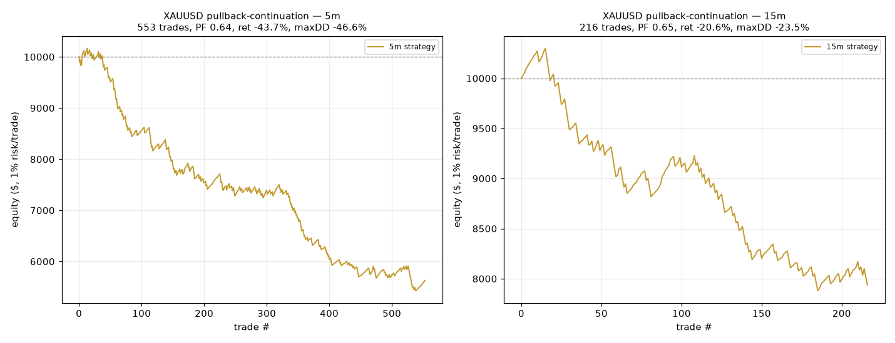

# GOLD (XAUUSD) Pullback-Continuation Backtest — Results

> **Preliminary.** Single ~1-year Dukascopy sample; treat all numbers as indicative, not statistically robust.

## 1. Data acquisition & cleaning

**Source:** Dukascopy XAUUSD 5-minute BID candles (`XAUUSD_Candlestick_5_M_BID_01.11.2024-01.11.2025.csv`), retrieved from a public GitHub mirror after live providers (Yahoo/yfinance, Stooq, TwelveData, AlphaVantage) were all blocked by this environment's egress policy. The 15-minute series is **resampled from the same 5-minute feed** so both timeframes share one clean source.

- Raw rows: **105,408**
- Zero-volume flat candles dropped (weekend/holiday fills): **34,499**
- Bad-price rows dropped (<=0 or high<low): **0**
- Duplicate timestamps dropped: **0**
- Clean 5-min rows: **70,909**  |  15-min rows: **23,638**
- UTC range: **2024-10-31 22:00:00 → 2025-10-31 20:55:00**

**Fixes applied:** timestamps were stored in Dukascopy local time with a per-row GMT offset that switches +0200↔+0300 across DST — each row was individually converted to UTC. ~34.5k zero-volume weekend/holiday fill candles (O=H=L=C) were removed; the pattern logic additionally refuses to form across the resulting session-break gaps (see `gap_tolerance_mult`).

Sample of clean 5-min data (UTC):

```
                         open      high       low     close   volume
datetime_utc                                                        
2024-10-31 22:00:00  2743.945  2745.085  2743.265  2745.045  54020.0
2024-10-31 22:05:00  2745.135  2747.465  2745.135  2746.545  49830.0
2024-10-31 22:10:00  2746.554  2747.304  2746.405  2746.945  51840.0
2024-10-31 22:15:00  2746.945  2747.225  2746.525  2746.525  24820.0
2024-10-31 22:20:00  2746.525  2746.558  2745.625  2745.855  26940.0
...
                         open      high       low     close    volume
datetime_utc                                                         
2025-10-31 20:45:00  4003.448  4003.968  4001.748  4002.575  282670.0
2025-10-31 20:50:00  4002.465  4004.225  4002.108  4002.648  292930.0
2025-10-31 20:55:00  4002.705  4003.555  4000.715  4001.505  268170.0
```

## 2. Parameters
```
ema_period             = 50
atr_period             = 14
min_pullback_candles   = 2
big_candle_atr_mult    = 1.2
trigger_mode           = open
fractal_n              = 2
min_target_atr_mult    = 0.5
round_increment        = 5.0
stop_atr_buffer        = 0.1
spread_usd             = 0.3
slippage_usd           = 0.1
session_filter         = True
session_start          = 7
session_end            = 21
start_equity           = 10000.0
risk_pct               = 0.01
max_hold_bars          = 288
one_position_at_a_time = True
bar_minutes            = 5
gap_tolerance_mult     = 1.5
total_cost_usd         = 0.4  (spread+slippage per round trip)
```

## 3. Headline results (default params, session filter ON)

| Segment | Trades | Win% | Avg R | PF | Target-first% | MaxDD | Return |
|---|---|---|---|---|---|---|---|
| 5m (session ON) | 553 | 74.1% | -0.102 | 0.64 | 74.1% | -46.6% | -43.7% |
| 15m (session ON) | 216 | 71.8% | -0.105 | 0.65 | 71.8% | -23.5% | -20.6% |

### Bottom line

The pattern **wins often but loses money.** On 5m it hits its target 74% of the time, yet the average winner is only **+0.24R** while the average loser is **-1.09R** (median reward:risk ≈ **0.31:1**). With that payoff the break-even win rate is ~**77%**, so a 74% hit rate still yields a negative expectancy (avg **-0.102R**, PF **0.64**). The cause is structural: targets are the *nearest* S/R level (often <0.5R away) while stops sit beyond the whole pullback (often 2–4R away). §8 shows the pattern nonetheless **beats random on target-first rate**, i.e. it does identify genuine continuation — the edge is real but the default money-management throws it away. Widening targets / tightening stops (or a partial-take rule) is the obvious next experiment.

Payoff detail (session ON):

| TF | Win% | Avg win R | Avg loss R | Median R:R | Break-even Win% | Avg R |
|---|---|---|---|---|---|---|
| 5m | 74.1% | +0.24 | -1.09 | 0.31:1 | 77% | -0.102 |
| 15m | 71.8% | +0.27 | -1.06 | 0.30:1 | 77% | -0.105 |

## 4. Session filter ON vs OFF

| Segment | Trades | Win% | Avg R | PF | Target-first% | MaxDD | Return |
|---|---|---|---|---|---|---|---|
| 5m session ON | 553 | 74.1% | -0.102 | 0.64 | 74.1% | -46.6% | -43.7% |
| 5m session OFF | 917 | 73.9% | -0.116 | 0.59 | 73.9% | -68.6% | -66.2% |
| 15m session ON | 216 | 71.8% | -0.105 | 0.65 | 71.8% | -23.5% | -20.6% |
| 15m session OFF | 326 | 71.5% | -0.113 | 0.63 | 71.5% | -32.8% | -31.1% |

_Asian-session trades are included only in the OFF rows; gold's Asian hours are thinner, so compare the two to see the filter's effect._

## 5. Breakdown by direction (session ON)

| Segment | Trades | Win% | Avg R | PF | Target-first% | MaxDD | Return |
|---|---|---|---|---|---|---|---|
| 5m long | 315 | 75.2% | -0.089 | 0.67 | 75.2% | -46.3% | -43.7% |
| 5m short | 238 | 72.7% | -0.119 | 0.60 | 72.7% | -46.6% | -43.8% |
| 15m long | 126 | 71.4% | -0.105 | 0.66 | 71.4% | -23.1% | -19.8% |
| 15m short | 90 | 72.2% | -0.106 | 0.64 | 72.2% | -23.5% | -20.6% |

## 6. Breakdown by target type (session ON)

| Segment | Trades | Win% | Avg R | PF | Target-first% | MaxDD | Return |
|---|---|---|---|---|---|---|---|
| 5m fractal | 494 | 74.3% | -0.108 | 0.62 | 74.3% | -46.6% | -43.7% |
| 5m round | 59 | 72.9% | -0.055 | 0.81 | 72.9% | -45.8% | -44.8% |
| 15m fractal | 189 | 72.5% | -0.096 | 0.67 | 72.5% | -23.3% | -20.6% |
| 15m round | 27 | 66.7% | -0.169 | 0.52 | 66.7% | -22.7% | -19.0% |

## 7. Breakdown by week (5m, session ON)

| Week | Trades | Win% | Avg R | Total R |
|---|---|---|---|---|
| 2024-W44 | 1 | 0% | -1.07 | -1.07 |
| 2024-W45 | 12 | 83% | +0.23 | +2.76 |
| 2024-W46 | 12 | 67% | -0.17 | -2.08 |
| 2024-W47 | 16 | 69% | -0.13 | -2.11 |
| 2024-W48 | 9 | 67% | -0.27 | -2.42 |
| 2024-W49 | 13 | 54% | -0.42 | -5.47 |
| 2024-W50 | 11 | 73% | -0.16 | -1.73 |
| 2024-W51 | 9 | 56% | -0.37 | -3.36 |
| 2024-W52 | 4 | 75% | -0.19 | -0.76 |
| 2025-W01 | 12 | 92% | +0.07 | +0.82 |
| 2025-W02 | 15 | 80% | -0.09 | -1.38 |
| 2025-W03 | 15 | 73% | -0.17 | -2.53 |
| 2025-W04 | 10 | 90% | +0.09 | +0.85 |
| 2025-W05 | 18 | 56% | -0.40 | -7.15 |
| 2025-W06 | 10 | 80% | +0.02 | +0.17 |
| 2025-W07 | 8 | 88% | +0.18 | +1.48 |
| 2025-W08 | 10 | 60% | -0.29 | -2.88 |
| 2025-W09 | 14 | 79% | -0.07 | -0.98 |
| 2025-W10 | 13 | 85% | -0.03 | -0.42 |
| 2025-W11 | 13 | 100% | +0.21 | +2.73 |
| 2025-W12 | 12 | 58% | -0.28 | -3.41 |
| 2025-W13 | 10 | 80% | -0.01 | -0.13 |
| 2025-W14 | 7 | 71% | -0.10 | -0.71 |
| 2025-W15 | 13 | 85% | +0.04 | +0.46 |
| 2025-W16 | 9 | 67% | -0.09 | -0.83 |
| 2025-W17 | 9 | 78% | -0.03 | -0.25 |
| 2025-W18 | 12 | 75% | -0.02 | -0.26 |
| 2025-W19 | 9 | 78% | +0.01 | +0.08 |
| 2025-W20 | 8 | 88% | +0.12 | +0.92 |
| 2025-W21 | 10 | 80% | -0.00 | -0.03 |
| 2025-W22 | 11 | 73% | -0.16 | -1.74 |
| 2025-W23 | 11 | 55% | -0.35 | -3.89 |
| 2025-W24 | 8 | 50% | -0.43 | -3.43 |
| 2025-W25 | 9 | 44% | -0.51 | -4.56 |
| 2025-W26 | 17 | 82% | -0.03 | -0.52 |
| 2025-W27 | 11 | 73% | -0.20 | -2.25 |
| 2025-W28 | 7 | 57% | -0.36 | -2.52 |
| 2025-W29 | 7 | 57% | -0.39 | -2.74 |
| 2025-W30 | 9 | 100% | +0.15 | +1.38 |
| 2025-W31 | 8 | 75% | -0.15 | -1.16 |
| 2025-W32 | 15 | 80% | -0.08 | -1.14 |
| 2025-W33 | 9 | 67% | -0.22 | -1.97 |
| 2025-W34 | 5 | 80% | -0.11 | -0.54 |
| 2025-W35 | 12 | 100% | +0.20 | +2.40 |
| 2025-W36 | 13 | 54% | -0.22 | -2.87 |
| 2025-W37 | 6 | 100% | +0.26 | +1.57 |
| 2025-W38 | 9 | 78% | -0.12 | -1.05 |
| 2025-W39 | 12 | 83% | +0.06 | +0.75 |
| 2025-W40 | 9 | 89% | +0.14 | +1.24 |
| 2025-W41 | 11 | 82% | +0.10 | +1.08 |
| 2025-W42 | 12 | 25% | -0.67 | -8.04 |
| 2025-W43 | 10 | 90% | +0.11 | +1.13 |
| 2025-W44 | 8 | 100% | +0.26 | +2.10 |

## 8. Key hypothesis — does price reach the S/R target before the stop?

| Timeframe | Pattern target-first % | Random baseline target-first % (mean±sd) |
|---|---|---|
| 5m | 74.1% (553 trades) | 63.5% ± 1.9% |
| 15m | 71.8% (216 trades) | 60.0% ± 1.6% |

_'Target-first' = the trade's target level was touched before its stop. The baseline uses random entries with the same trend direction and the same target/stop construction._

## 9. Parameter sweep — big_candle_atr_mult × trigger_mode (session ON)

| TF | big_mult | trigger | Trades | Win% | Avg R | PF | Target-first% | Return |
|---|---|---|---|---|---|---|---|---|
| 5m | 1.0 | open | 990 | 69.5% | -0.153 | 0.55 | 69.5% | -78.5% |
| 5m | 1.0 | extreme | 741 | 72.9% | -0.122 | 0.59 | 72.9% | -60.0% |
| 5m | 1.2 | open | 553 | 74.1% | -0.102 | 0.64 | 74.1% | -43.7% |
| 5m | 1.2 | extreme | 402 | 78.1% | -0.065 | 0.73 | 78.1% | -23.4% |
| 5m | 1.5 | open | 191 | 76.4% | -0.095 | 0.63 | 76.4% | -16.8% |
| 5m | 1.5 | extreme | 126 | 84.1% | -0.012 | 0.93 | 84.1% | -1.6% |
| 15m | 1.0 | open | 338 | 72.8% | -0.071 | 0.75 | 72.8% | -21.9% |
| 15m | 1.0 | extreme | 263 | 76.0% | -0.047 | 0.81 | 76.0% | -12.1% |
| 15m | 1.2 | open | 216 | 71.8% | -0.105 | 0.65 | 71.8% | -20.6% |
| 15m | 1.2 | extreme | 159 | 75.5% | -0.069 | 0.73 | 75.5% | -10.6% |
| 15m | 1.5 | open | 92 | 72.8% | -0.110 | 0.62 | 72.8% | -9.7% |
| 15m | 1.5 | extreme | 68 | 73.5% | -0.122 | 0.56 | 73.5% | -8.1% |

## 10. Equity curve



Saved to `equity_curve.png` (5m and 15m, 1% risk per trade, sequential non-overlapping trades, costs applied).

## 11. Caveats

- **Small sample / single source.** ~1 year of one broker's (Dukascopy) 5-min BID data. No bid/ask spread modelled beyond the flat $0.40 round-trip cost; real XAUUSD spread widens in thin hours and around news.
- **BID candles only** — entries/exits assume fills at candle prices plus the flat cost; no partial fills or requotes.
- **Conservative same-bar rule:** when a candle spans both stop and target, the stop is assumed hit first.
- **One position at a time**, so overlapping signals are skipped; the raw signal edge (target-first %) is reported separately in §8.
- 15m is derived by resampling 5m, so the two timeframes are not independent samples.
- No walk-forward / out-of-sample split or multiple-testing correction on the parameter sweep — treat the best cell as in-sample.

