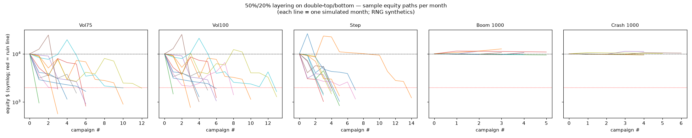

# Double-top / double-bottom + "layering" (50% + 20%) — does it work on the synthetics?

> Follow-up to `results.md` / `results_strategy.md`. Implements the described system
> mechanically and separates two independent questions. **Simulated Deriv-style data
> (documented processes), not live Deriv feed. Not financial advice.**

## What was built (`pattern_layering.py`)

- **Double top / double bottom** from confirmed fractal swings: two peaks (troughs)
  within `top_tol_atr` of each other, a neckline between them, minimum pattern height,
  plus a **candlestick confirmation** (bearish/bullish engulfing) at the second peak.
- **Layering:** initial tranche risking **50%** of the account on confirmation, then a
  second tranche risking **+20%** on the neckline break.
- **Stop → break-even** for all tranches once the neckline breaks (solid confirmation).
- **Target** = measured move (neckline ± pattern height) toward the next zone.
- **Rejection** (opposite engulfing) before target ⇒ **close the remainder** (bank it).
- **Spike realism:** on Boom/Crash a stop can be gapped through; on spike bars the fill
  is slipped partway to the bar's adverse extreme.

Two things are measured **separately**, because they answer different questions.

## (A) Does the pattern have an EDGE?  (constant $ risk, ruin turned off, R pooled)

Per-campaign result in R (1R = initial tranche risk), pooled over many simulated seeds:

| Instrument | Campaigns | Win% | **Mean R** | Std err | Worst R |
|---|---|---|---|---|---|
| Volatility 75 | 1409 | 19.1% | **−0.293** | 0.035 | −2.20 |
| Volatility 100 | 1409 | 19.2% | **−0.274** | 0.035 | −2.17 |
| Step Index | 1401 | 22.1% | **−0.183** | 0.031 | −1.46 |
| Boom 1000 | 105 | 14.3% | **+0.002** | 0.013 | −1.02 |
| Crash 1000 | 116 | 8.6% | **−0.016** | 0.010 | −1.02 |
| **Gold (real)** | 329 | 21.9% | **−0.245** | 0.060 | −2.38 |

**No instrument shows a positive edge.** Volatility/Step and even real gold are
significantly **negative** (−0.29R is ~8 standard errors below zero). Boom/Crash sit at
**zero within noise** (~0.00 ± 0.01) — and on only ~100 campaigns, so that's "no
detectable edge," not a win. The low win rates (9–22%) are the tell: the **measured-move
target is rarely reached** on a random walk — price has no reason to travel the pattern's
projected distance, so most campaigns die at the stop, at break-even, or on a rejection.

The management layer (break-even stops, rejection-close) does exactly what management
always does: it **reshapes** the distribution (more small scratches, fewer big winners) but
**cannot manufacture edge**. With no directional edge in the entry, the net stays ≤ 0.

## (B) What does the literal 50% + 20% sizing DO to the account?

Same system, now sized as described (50% initial, +20% add), one simulated **month** per
seed, 120 seeds:

| Instrument | Campaigns/mo | Median final $ | **% months blown (<20%)** | % months up | Worst $ |
|---|---|---|---|---|---|
| Volatility 75 | 5.7 | $1,193 | **100%** | 0% | $232 |
| Volatility 100 | 6.3 | $1,253 | **100%** | 0% | $350 |
| Step Index | 7.8 | $1,440 | **100%** | 0% | $704 |
| Boom 1000 | 3.1 | $9,764 | 0% | 27% | $2,396 |
| Crash 1000 | 3.1 | $9,789 | 0% | 28% | $4,637 |



From $10,000, on the instruments where the pattern actually triggers (Vol/Step) the account
is **blown to under 20% in 100% of simulated months**, after only ~6–8 campaigns. Some
paths spike *up* first — a lucky 50% winner briefly doubles the account — then a normal
losing streak wipes it out. That is not bad luck; it is arithmetic: **risk 50–70% per idea
at a ~19% win rate and a losing run arrives almost immediately.** Two full losers ≈ −70% ×
−70% of stake ⇒ you cannot recover.

Boom/Crash "survive" only because the sawtooth (spikes make higher-highs / lower-lows, not
equal peaks) means the pattern **barely forms** (~3 campaigns/month) — not because the
scheme is safe. Even there it's a coin-flip around slightly-negative (27–28% of months up),
and the worst months already sit at −53% to −76%; run it long enough and it degrades too.

## Bottom line

1. **Double-top/bottom has no edge on these synthetics** (Vol/Step negative; Boom/Crash
   zero within noise) — consistent with everything prior: RNG feeds have no structure to
   trade, and real gold is negative here too with these exits.
2. **The 50% + 20% layering is a ruin machine, independent of edge.** On the instruments
   that trade, it blows the account within a single month, every time. Pyramiding + break-
   even stops + trailing change the *shape* of the ride, never the *sign* of the
   expectation.
3. There is no combination of these two that produces "a very good strategy." A sound edge
   sized at 50–70% per trade still goes to zero; a no-edge system sized that way goes to
   zero faster. The only survivable version is a real edge (e.g. the gold RR strategy in
   `results_strategy.md`) risked at a **small fixed fraction (~0.5–2%)** per trade.

## Reproduce

```
python3 layering_experiment.py   # edge table + ruin table + layering_ruin_paths.png
```
