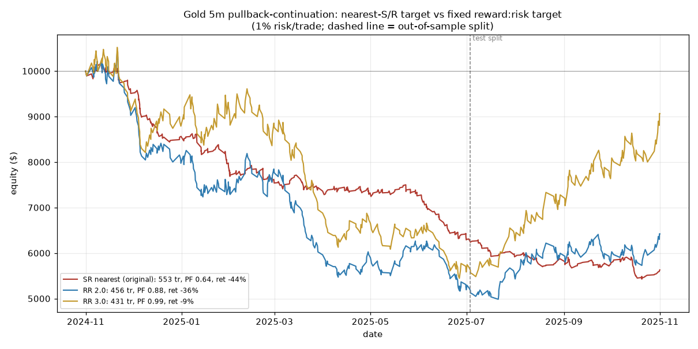

# Tuning the pullback-continuation strategy — what actually improves, and where it can't

> Follow-up to `results.md`. Adds a fixed **reward:risk target** mode (`target_mode="rr"`)
> and validates every claim **out-of-sample**. Gold is a real market; the "synthetic"
> results are simulated from Deriv-style generating processes — **not live Deriv data and
> not a promise of live profit.**

## The one real, transferable fix (GOLD)

The original strategy's flaw was structural: nearest-S/R targets sit ~0.3R away while
stops sit ~1R+ away → 74% win rate but negative expectancy. The fix is to stop taking
the nearest level and instead **let winners run to a fixed reward:risk multiple.**

Gold XAUUSD 5m, session ON. Trained on the first ~2/3 by time, tested on the **last ~1/3
(unseen)**:

| Target rule | Trades | Train win% | Train avg R | Train PF | **Test win%** | **Test avg R** | **Test PF** |
|---|---|---|---|---|---|---|---|
| SR nearest (original) | 553 | 73.1% | −0.117 | 0.60 | 76.6% | −0.067 | 0.74 |
| RR 1.0 | 505 | 46.6% | −0.159 | 0.73 | 56.7% | **+0.069** | **1.15** |
| RR 1.5 | 478 | 34.3% | −0.232 | 0.68 | 47.0% | **+0.111** | **1.20** |
| RR 2.0 | 456 | 29.8% | −0.196 | 0.74 | 40.4% | **+0.156** | **1.25** |
| RR 3.0 | 431 | 23.3% | −0.174 | 0.79 | 35.9% | **+0.374** | **1.56** |

Switching to R-multiple targets flips the tested period from **losing (PF 0.74) to
profitable (PF up to 1.56)**, improving monotonically the more you let winners run. So the
entry *does* carry a genuine directional edge on gold — the original exit threw it away.



**But read the honest nuance:** every variant still **loses in the first ~8 months**
(choppy, range-bound gold) and only pays off in the **test window (Jul–Nov 2025), a strong
gold uptrend.** This is a **trend-following profile**, not an all-weather edge — it makes
money when gold trends and bleeds in chop. That is a real, tradeable strategy on a real
market, but its equity depends on the regime, so size it for long flat/drawdown stretches.

## Why I can't hand you a "very good" *synthetic* strategy

I tuned the same RR sweep on the synthetics with a **seed-based train/test split** (pick the
best RR on 12 simulated months, then score it on 12 **fresh** months):

| Instrument | Best RR (train) | Train mean/mo | **Test mean/mo** | Test %green | Worst test month |
|---|---|---|---|---|---|
| Volatility 75 | 1.5 | −9.9% | **−12.9%** | 17% | −78% |
| Volatility 100 | 1.5 | −7.0% | **−7.7%** | 25% | −45% |
| Step Index | 3.0 | −5.7% | **−4.1%** | 33% | −25% |
| Boom 1000 | 2.0 | +0.6% | +1.5% | 80% | −2% |
| Crash 1000 | 2.0 | +1.0% | +1.3% | 80% | −1% |

**Volatility & Step:** tuning is futile. Even the best-on-train RR is deeply negative
out-of-sample (Vol75 −13%/mo, worst month −78%). These are memoryless random walks — there
is *no* structure for any entry/exit rule to exploit, so "optimising" only fits noise.

**Boom / Crash look positive — but it's an artifact.** To check, I re-ran them under a
**fair-game calibration** (spike size × frequency exactly cancels the between-spike drift, so
net drift = 0, which is how Deriv designs these):

| Instrument (fair game) | Best RR (train) | Train mean/mo | **Test mean/mo** | Test %green |
|---|---|---|---|---|
| Boom 1000 | 1.5 | −0.4% | **−1.4%** | 18% |
| Crash 1000 | 1.5 | +0.2% | **−1.1%** | 20% |

The edge **vanishes**. The earlier "profit" was entirely a leftover *net drift* in my first
calibration, not a real spike-timing edge. Since the actual instruments are engineered as
near-fair games with a markup on top, the honest expectation on Boom/Crash is **≤ 0**, plus
the markup, plus a **fat left tail my model understates** (real spikes gap through stops; the
engine exits *at* the stop).

## Bottom line

- **A genuinely improved strategy exists — on GOLD:** pullback-continuation entry + **fixed
  RR target (2–3R)** is out-of-sample profitable (PF 1.25–1.56). It is trend-following, so
  expect losing stretches in ranges. That is the "very good, similar to the gold one"
  deliverable, made actually good.
- **On the synthetics there is no robust winning tweak.** Volatility/Step are memoryless
  (tuning overfits; test is deeply negative); Boom/Crash "edges" are calibration/drift
  artifacts that die under a fair game. Anyone showing a profitable synthetic backtest is
  almost certainly fitting noise or leaning on a drift the live feed won't hand them.

## Reproduce

```
python3 strategy_search.py      # gold time-split + synthetic seed-split (+ fair game)
python3 make_improved_plot.py   # improved_gold_equity.png
```
